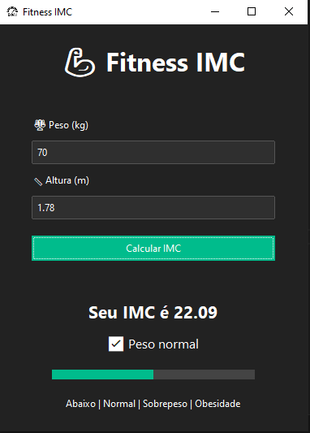

# 💪 Fitness IMC

Uma **calculadora de IMC moderna** feita em Python com interface gráfica estilo aplicativo fitness.

O projeto calcula o **Índice de Massa Corporal (IMC)** a partir do peso e altura do usuário e exibe:

- Valor do IMC
- Classificação de peso
- Barra visual colorida indicando a faixa do resultado

---

# 📸 Preview



---

# 🚀 Funcionalidades

- 🧮 Cálculo automático de IMC
- 📊 Barra visual indicando a faixa do IMC
- 🎨 Interface moderna estilo aplicativo
- ⚡ Feedback visual instantâneo
- 🏷 Classificação automática do resultado

---

# 🧠 Classificação de IMC

| IMC | Classificação |
|-----|--------------|
| Menor que 18.5 | Abaixo do peso |
| 18.5 – 24.9 | Peso normal |
| 25 – 29.9 | Sobrepeso |
| 30 ou mais | Obesidade |

---

# 🛠 Tecnologias Utilizadas

- **Python 3**
- **Tkinter**
- **ttkbootstrap**

Biblioteca usada para criar a interface moderna:

https://github.com/israel-dryer/ttkbootstrap

---

# 📦 Instalação

Clone o repositório:

```bash
git clone https://github.com/seu-usuario/fitness-imc.git
